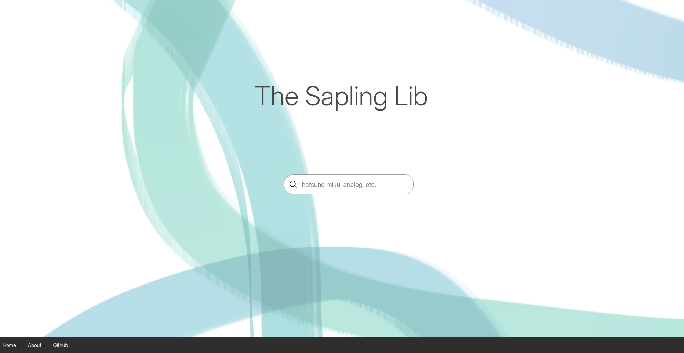
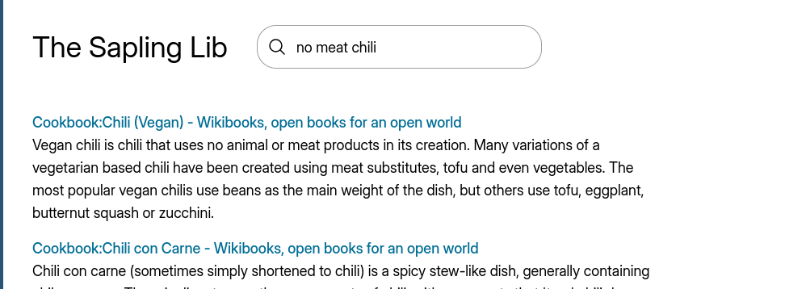

Library by Shadows

A Crowdsourced Search Engine where human and not bots make search results

If you want to see the most recent changes, check out the repo's branches.


# Demo

TODO





# Host

To host it, simply

```bash
git clone git@github.com:pbun206/library-by-shadows.git
# or git clone https://github.com/pbun206/library-by-shadows.git
cd library-by-shadows/
just run
```
During its first run, it'll download [a FastEmbed model](https://docs.rs/fastembed/latest/fastembed/). 

# AI Use

First of all, the search uses a hybird model to use BM25 and density search. Part of density search is transformer models. So in that way, this is an AI-powered application.

Currently, this codebase is 50% from coding templates, 45% my code, and 5% AI generated code when I get stuck. I will testify that I understand the code of the latter 50%. My today philosophy is that AI can be a learning tool but not should be used as only the learning tool.

Also I don't know how much AI is being used in the dependencies. 


